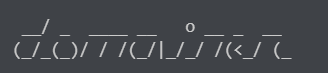

# Welcome to domainer!

Domainer is a custom script designed to search for subdomains of a given domain. 
The script uses different techniques to scan a target domain and discover all of its subdomains. 

The syntax of the target should be: SLD + TLD \
For example instead of `https://www.github.com` use `github.com`

## Clone repository:
```bash
git clone https://github.com/grethler/domainer
cd ./domainer
```

## Install dependencies:
```bash
pip install -r .\requirements.txt
```

## Run the script with Python:
```bash
python .\domainer.py [-h] [-w] [-d DICT] [-n] [-A] target
```

## Run the script with Docker:
```bash
docker build -t domainer .
docker run -it domainer [-h] [-w] [-d DICT] [-n] [-A] target
```
Dont forget to remove the container after usage.